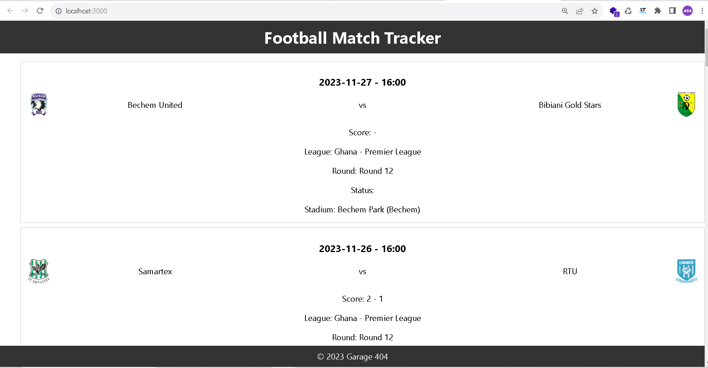

# Objectif

L'objectif de cet exercice est de créer une application React qui utilise l'API AllSports pour afficher les matchs de football d'une certaine période.

Dans un premier temps, des données sont fournies dans le fichier `data.json`. vous pouvez les utiliser pour afficher les matchs dans l'application.

Dans un second temps, vous devrez utiliser l'API AllSports pour récupérer les matchs de football et les afficher dans l'application.

# Sprint 1 : Afficher les matchs

## Consignes

- Utiliser le framework React avec [Create React App](https://create-react-app.dev/) ou [Vite](https://vitejs.dev/guide/) pour créer l'application.

preparer les données en exportant le tableau `data` dans un fichier `data.js` et en l'important dans le composant `App.js`.

```js
// data.js
export const data = {
  // data from data.json
};
```

```js
// App.js
import { data } from "./data.js";
```

- Créer un composant `MatchList` qui affiche une liste de matchs.
- Créer un composant `Match` qui affiche les informations d'un match.

- Le composant `Match` doit afficher les informations suivantes :

  - Le nom de la league
  - Le nom des équipes
  - Le score
  - La date du match
  - Les logo des équipes
  - Le nom des buteurs de chaque équipe

- Le composant `MatchList` doit afficher les matchs dans une liste de grande cards.
- Le composant `App` doit afficher le composant `MatchList`.

Vous pouvez créer des composants supplémentaires si vous le souhaitez.

## Résultat attendu



# Sprint 2 : Récupérer les matchs de l'API

## Consignes

- Créer un compte sur [AllSports API](https://allsportsapi.com/).
- Récupérer votre clé API.
- Utiliser la clé API et verifier la league dont vous avez acces avec cet url :
  `apiv2.allsportsapi.com/football?met=Leagues&APIkey=xxxxxxxxxxxxxxxxxxxxxxxxxxxxxxxx`
- Vous pouvez ensuite utiliser les paramètres `leagueId` et `from` pour récupérer les matchs de football d'une certaine période :
  `apiv2.allsportsapi.com/football?met=Fixtures&APIkey=xxxxxxxxxxxxxxxxxxxxxxxxxxxxxxxxxxxxxxxxxxxxxxxxxxxxxxxx&from=2023-11-15&to=2023-11-27&leagueId=177`
  adapter la requête en fonction de ce que vous pouvez recuperer.

Utilisez Postman pour vous aider à tester les requêtes : https://www.postman.com/
Postman est un outil tres utile pour tester les API. Il permet de tester les requêtes et de voir les réponses. Vous pouvez facilement modifier les paramètres de la requête et voir les résultats.

### Récupérer les matchs et utilisation d'un useEffect (hook)

- Dans le composant MatchList, preparer un state `matches` qui contiendra les matchs.
- Utiliser un useEffect pour récupérer les matchs de l'API et les stocker dans le state `matches`. Vous pouvez utiliser la fonction `fetch` pour faire la requête ou utiliser une librairie comme `axios`.(https://www.npmjs.com/package/axios)

Normalement, l'application n'a pas besoin d'etre modifier pour afficher les matchs de l'API.

## Bonus

- Créer un composant `Loader` qui affiche un loader pendant que les matchs sont en train d'etre chargés. Quand les matchs sont chargés, le loader disparait et les matchs sont affichés.
- Ajouter un composant `Header` et un `Footer` à l'application.
- Ajouter un composant `MatchDetail` qui affiche les informations d'un match dans une modal. Le composant `MatchDetail` doit etre affiché quand on clique sur un match dans la liste des matchs.
